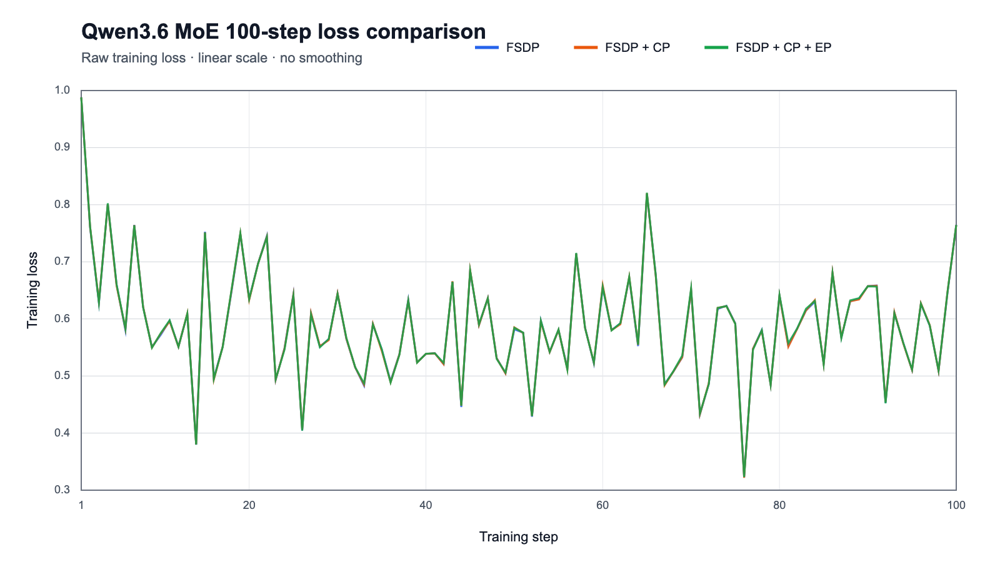

# Qwen3.6-35B-A3B训练启动教程

## 1. 实测环境

硬件：8 卡 Ascend 910B3。

| 组件 | 实测版本 |
| --- | --- |
| Python | 3.11.15 |
| CANN | 9.1.0 |
| PyTorch | 2.9.0 |
| torch-npu | 2.9.0.post6 |
| Triton-Ascend | 3.2.1 |
| Transformers | 5.13.0 |
| Tokenizers | 0.22.2 |
| Datasets | 4.0.0 |
| Hugging Face Hub | 1.22.0 |
| TorchData | 0.11.0 |
| Pandas / PyArrow | 3.0.3 / 24.0.0 |
| NumPy | 1.26.4 |
| Safetensors | 0.8.0 |
| PyYAML | 6.0.3 |
| psutil / tqdm | 7.2.2 / 4.70.0 |

高性能算子依赖 Triton-Ascend 和 torch-npu，相关软件版本需要匹配。

安装与上述实测环境一致的算子相关 Python 包：

```bash
python3 -m pip install \
  --index-url=https://repo.huaweicloud.com/repository/pypi/simple \
  torch==2.9.0 torch-npu==2.9.0.post6
python3 -m pip install \
  --index-url=https://mirrors.huaweicloud.com/ascend/repos/pypi \
  triton-ascend==3.2.1
```

## 2. 模型与数据

准备 Hugging Face 格式的 `Qwen/Qwen3.6-35B-A3B` 权重，以及 conversation JSONL 数据。每行至少包含
一个 `messages` 字段：

```json
{"messages":[{"role":"user","content":"你好"},{"role":"assistant","content":"你好！"}]}
```

示例使用 Decif-30k conversation 数据集，通过 tokenizer 自带的 chat template 在线完成模板渲染和
tokenization。`max_seq_len` 为 4096，`micro_batch_size` 为 1，`global_batch_size` 为 8。

## 3. 单机 8 卡启动

[`launch_1node_8dies.sh`](launch_1node_8dies.sh) 使用 `torchrun` 启动 8 个进程，并接受
`--section.field=value` 形式的配置覆盖。先设置模型、tokenizer 和数据路径：

```bash
cd /path/to/hyper-parallel
source /home/chaoran/cann/cann-9.1.0/set_env.sh

export MODEL_DIR=/path/to/Qwen3.6-35B-A3B
export TRAIN_JSONL=/path/to/train.jsonl
mkdir -p outputs/qwen3_6_moe/logs
```

### FSDP

```bash
bash examples/qwen3_6_moe/launch_1node_8dies.sh \
  --model.pretrained_model_name_or_path="$MODEL_DIR" \
  --dataset.model_assets.tokenizer.pretrained_model_name_or_path="$MODEL_DIR" \
  --dataset.data_path="$TRAIN_JSONL" \
  --training.train_iters=100 \
  --accelerator.cp_size=1 \
  --accelerator.ep_size=1 \
  --fsdp_config.dp_shard_size=8 \
  --fsdp_config.edp_shard_size=1 \
  2>&1 | tee outputs/qwen3_6_moe/logs/fsdp.log
```

### FSDP + CP

```bash
bash examples/qwen3_6_moe/launch_1node_8dies.sh \
  --model.pretrained_model_name_or_path="$MODEL_DIR" \
  --dataset.model_assets.tokenizer.pretrained_model_name_or_path="$MODEL_DIR" \
  --dataset.data_path="$TRAIN_JSONL" \
  --training.train_iters=100 \
  --accelerator.cp_size=2 \
  --accelerator.ep_size=1 \
  --fsdp_config.dp_shard_size=8 \
  --fsdp_config.edp_shard_size=1 \
  2>&1 | tee outputs/qwen3_6_moe/logs/fsdp_cp.log
```

### FSDP + CP + EP

```bash
bash examples/qwen3_6_moe/launch_1node_8dies.sh \
  --model.pretrained_model_name_or_path="$MODEL_DIR" \
  --dataset.model_assets.tokenizer.pretrained_model_name_or_path="$MODEL_DIR" \
  --dataset.data_path="$TRAIN_JSONL" \
  --training.train_iters=100 \
  --accelerator.cp_size=2 \
  --accelerator.ep_size=2 \
  --fsdp_config.dp_shard_size=8 \
  --fsdp_config.edp_shard_size=4 \
  2>&1 | tee outputs/qwen3_6_moe/logs/fsdp_cp_ep.log
```

不复制 expert 参数时，应满足
`ep_size × edp_shard_size = world_size / pp_size`。当前为单个 pipeline stage，因此右侧就是
`world_size`：8 卡配置使用 `ep_size=2`、`edp_shard_size=4`。

## 4. Loss 曲线对比



性能与显存参考如下。步时统计使用 steps 11–100 的平均值；online 样本长度不同，单步耗时会有波动。

| 方案 | 平均 step time | 最大已分配显存 |
| --- | ---: | ---: |
| FSDP + CP + EP | 7.853 s | 45.61 GB |
